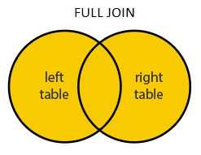

# SQL Interview preparation

# Table of contents

1. [Definition](#definition)
2. [Syntax](#syntax)
3. [Statements](#statements)
   1. [SELECT](#select)
   2. [SELECT DISTINCT](#where)
   3. [WHERE](#logical)
   4. [AND, OR, NOT](#logical)
   5. [ORDER BY](#order_by)
   6. [INSERT INTO](#insert_into)
   7. [NULL Values](#null)
   8. [UPDATE](#update)
   9. [DELETE](#delete)
   10. [TOP, LIMIT, FETCH FIRST, ROWNUM](#top)
   11. [MIN() and MAX()](#min_max)
   12. [COUNT(), AVG() and SUM()](#count_avg_sum)
   13. [LIKE](#like)
   14. [Wildcards](#wildcards)
   15. [IN](#in)
   16. [BETWEEN](#between)
   17. [Aliases](#aliases)
   18. [JOIN](#join)
       1. [INNER JOIN](#inner_join)
       2. [LEFT JOIN](#left_join)
       3. [RIGHT JOIN](#right_join)
       4. [FULL JOIN](#full_join)
       5. [SELF JOIN](#self_join)
   19. [UNION](#union)
   20. [GROUP BY](#group_by)
   21. [HAVING](#having)
   22. [EXISTS](#exists)
   23. [ANY and ALL](#any_all)
   24. [SELECT INTO](#select_into)
   25. [INSERT INTO SELECT](#insert_into_select)
   26. [CASE](#case)
   27. [NULL functions](#null_functions)
   28. [Store procedure](#store_procedure)
   29. [Comments](#comments)
   30. [Operators](#operators)
4. [Database](#database)
   1. [CREATE DATABASE](#create_database)
   2. [DROP DATABASE](#drop_database)
   3. [BACKUP DATABASE](#backup_database)
   4. [CREATE TABLE](#create_table)
   5. [DROP TABLE](#drop_table)
   6. [ALTER TABLE](#alter_table)
   7. [Constraints](#constraints)
   8. [Dates](#dates)
   9. [CREATE VIEW](#create_view)
5. [References](#references)

## 1. Definition <a name="definition"></a>

**SQL** stands for **Structured Query Language**.
**RDBMS** stands for **Relational Database Management** system.
RDBMS is the basis for SQL, and for all modern database systems such as MS SQL Server, IBM DB2, Oracle, MySQL, and Microsoft Access.
The data in RDBMS is stored in database objects called tables. A table is a collection of related data entries and it consists of columns and rows.

## 2. Syntax <a name="syntax"></a>

Most of the actions you need to perform on a database are done with SQL statements. Some database systems require a semicolon at the end of each SQL statement.

Semicolon is the standard way to separate each SQL statement in database systems that allow more than one SQL statement to be executed in the same call to the server.

## 3. Statements <a name="statements"></a>

A list of all keywords used to create an SQL statement.

### 3.1 SELECT <a name="select"></a>

The `SELECT` statement is used to select data from a database.

The data returned is stored in a result table, called the **result-set**.

```SQL
SELECT column1, column2, ...
FROM table_name;
```

```SQL
SELECT * FROM table_name;
```

### 3.2 SELECT DISTINCT <a name="select_distinct"></a>

The `SELECT DISTINCT` statement is used to return only distinct (different) values.

```SQL
SELECT DISTINCT column1, column2, ...
FROM table_name;
```

### 3.3 WHERE <a name="where"></a>

The `WHERE` clause is used to filter records.

```SQL
SELECT column1, column2, ...
FROM table_name
WHERE condition;
```

### 3.4 AND, OR, NOT <a name="logical"></a>

The `WHERE` clause can be combined with `AND`, `OR`, and `NOT` operators.

```SQL
SELECT column1, column2, ...
FROM table_name
WHERE condition1 AND condition1;
```

Will select where both `condition1` AND `condition2` are **TRUE**.

```SQL
SELECT column1, column2, ...
FROM table_name
WHERE condition1 OR condition2;
```

Will select where either `condition1` OR `condition2` are **TRUE**.

```SQL
SELECT column1, column2, ...
FROM table_name
WHERE NOT condition;
```

Will select where `condition` is **FALSE**.

### 3.5 ORDER BY <a name="order_by"></a>

The `ORDER BY` keyword is used to sort the **result-set** in ascending or descending order.

The `ORDER BY` keyword sorts the records in **ascending order by default**. To sort the records in **descending order, use the `DESC` keyword**.

```SQL
SELECT column1, column2, ...
FROM table_name
ORDER BY column1, column2, ... ASC|DESC;
```

### 3.6 INSERT INTO <a name="insert_into"></a>

The `INSERT INTO` statement is used to insert new records in a table.

It is possible to write the `INSERT INTO` statement in two ways:

```SQL
INSERT INTO table_name (column1, column2, column3, ...)
VALUES (value1, value2, value3, ...);
```

OR:

```SQL
INSERT INTO table_name
VALUES (value1, value2, value3, ...);
```

### 3.7 NULL Values <a name="null"></a>

A field with a `NULL value` is a field with **no value**.

If a field in a table is optional, it is possible to insert a new record or update a record without adding a value to this field. Then, the field will be saved with a NULL value.

In order to test if a value is `NULL` or not use the `IS NULL` and `IS NOT NULL` operators.

```SQL
SELECT column_names
FROM table_name
WHERE column_name IS NULL;
```

```SQL
SELECT column_names
FROM table_name
WHERE column_name IS NOT NULL;
```

### 3.8 UPDATE <a name="update"></a>

The `UPDATE` statement is used to modify the existing records in a table.

```SQL
UPDATE table_name
SET column1 = value1, column2 = value2, ...
WHERE condition;
```

### 3.9 DELETE <a name="delete"></a>

The `DELETE` statement is used to delete existing records in a table.

```SQL
DELETE FROM table_name WHERE condition;
```

### 3.10 TOP, LIMIT, FETCH FIRST, ROWNUM <a name="top"></a>

The `SELECT TOP` clause is used to specify the number of records to return.

```SQL
SELECT TOP number|percent column_name(s)
FROM table_name
WHERE condition;
```

Not all database systems support the `SELECT TOP` clause. MySQL supports the `LIMIT` clause to select a limited number of records, while Oracle uses `FETCH FIRST` n `ROWS ONLY` and `ROWNUM`.

### 3.11 MIN() and MAX() functions <a name="min_max"></a>

The MIN() function returns the smallest value of the selected column.

The MAX() function returns the largest value of the selected column.

```SQL
SELECT MIN(column_name)
FROM table_name
WHERE condition;
```

```SQL
SELECT MAX(column_name)
FROM table_name
WHERE condition;
```

### 3.12 COUNT(), AVG() and SUM() functions <a name="count_avg_sum"></a>

The `COUNT()` function returns the number of rows that matches a specified criterion.

```SQL
SELECT COUNT(column_name)
FROM table_name
WHERE condition;
```

The `AVG()` function returns the average value of a **numeric column**.

```SQL
SELECT AVG(column_name)
FROM table_name
WHERE condition;
```

The `SUM()` function returns the total sum of a **numeric column**.

```SQL
SELECT SUM(column_name)
FROM table_name
WHERE condition;
```

### 3.13 LIKE <a name="like"></a>

The `LIKE` operator is used in a `WHERE` clause to search for a **specified pattern** in a column.

There are two wildcards often used in conjunction with the `LIKE` operator:

- The percent sign `(%)` represents zero, one, or multiple characters
- The underscore sign `(_)` represents one, single character

```SQL
SELECT column1, column2, ...
FROM table_name
WHERE columnN LIKE pattern;
```

### 3.14 Wildcards <a name="wildcards"></a>

A `wildcard character` is used to **substitute one or more characters in a string**.

Wildcard characters are used with the `LIKE` operator.

For **SQL**:

| Symbol | Description                             | Example                         |
| ------ | --------------------------------------- | ------------------------------- |
| \%     | Zero or more characters                 | `bl%` finds bl, black, blue ... |
| \_     | A single character                      | `bl%` finds bl, bla, blu ...    |
| []     | Characters from within the brackets     | `h[oa]t` finds hot or hat       |
| [^]    | Characters not from within the brackets | `h[^oa]t` finds hit             |
| [-]    | Represents any character from a range   | `c[a-b]t` finds cat and cbt     |

For **MS Access**:

| Symbol | Description                                            | Example                             |
| ------ | ------------------------------------------------------ | ----------------------------------- |
| \*     | Zero or more characters                                | `bl*` finds bl, black, blue ...     |
| ?      | Represents a single character                          | `h?t` finds hat, hot, hit ...       |
| []     | Represents a single character from within the brackets | `h[oa]t` finds hot or hat           |
| [!]    | Represents any character not in the brackets           | `h[!oa]t` finds hit                 |
| [-]    | Represents any character from a range                  | `c[a-b]t` finds cat and cbt         |
| #      | Represents any single numeric character                | `1#3` finds 103, 113, 123, ..., 193 |

### 3.15 IN <a name="in"></a>

The `IN` operator allows you to specify multiple values in a `WHERE` clause.

```SQL
SELECT column_name(s)
FROM table_name
WHERE column_name IN (value1, value2, ...);
```

or:

```SQL
SELECT column_name(s)
FROM table_name
WHERE column_name IN (SELECT STATEMENT);
```

### 3.16 BETWEEN <a name="between"></a>

The `BETWEEN` operator selects values within a given range. The values can be numbers, text, or dates.

The `BETWEEN` operator is inclusive: **begin and end values are included**.

```SQL
SELECT column_name(s)
FROM table_name
WHERE column_name BETWEEN value1 AND value2;
```

### 3.17 Aliases <a name="aliases"></a>

`SQL` aliases are used to **give a table, or a column in a table, a temporary name**.

Aliases are often used to make column names more readable.

An alias **only exists for the duration of that query**.

An alias is created with the `AS` keyword.

```SQL
SELECT column_name AS alias_name
FROM table_name;
```

### 3.18 JOIN <a name="join"></a>

A `JOIN` clause is used to **combine rows from two or more tables, based on a related column between them**.

```SQL
SELECT Orders.OrderID, Customers.CustomerName, Orders.OrderDate
FROM Orders
INNER JOIN Customers ON Orders.CustomerID=Customers.CustomerID;
```

#### 3.18.1 INNER JOIN <a name="inner_join"></a>

`(INNER) JOIN`: Returns records that have matching values in both tables

```SQL
SELECT column_name(s)
FROM table1
INNER JOIN table2
ON table1.column_name = table2.column_name;
```


#### 3.18.2 LEFT JOIN <a name="left_join"></a>

The `LEFT JOIN` keyword returns **all records from the left table (table1)**, and **the matching records from the right table (table2)**. The result is 0 records from the right side, if there is no match.

```SQL
SELECT column_name(s)
FROM table1
LEFT JOIN table2
ON table1.column_name = table2.column_name;
```


#### 3.18.3 RIGHT JOIN <a name="right_join"></a>

The `RIGHT JOIN` keyword returns **all records from the right table (table2)**, and **the matching records from the left table (table1)**. The result is 0 records from the left side, if there is no match.

```SQL
SELECT column_name(s)
FROM table1
RIGHT JOIN table2
ON table1.column_name = table2.column_name;
```


#### 3.18.4 FULL JOIN <a name="full_join"></a>

The `FULL OUTER JOIN` keyword returns all records when there is a match in left (table1) or right (table2) table records.

```SQL
SELECT column_name(s)
FROM table1
FULL OUTER JOIN table2
ON table1.column_name = table2.column_name
WHERE condition;
```



#### 3.18.5 SELF JOIN <a name="self_join"></a>

A self join is a regular join, but the table is joined with itself.

```SQL
SELECT column_name(s)
FROM table1 T1, table1 T2
WHERE condition;
```

T1 and T2 are just different aliases for the same table1.

### 3.19 UNION <a name="union"></a>

The `UNION` operator is used to combine the result-set of two or more `SELECT` statements.

Rules:

- Every `SELECT` statement within `UNION` **must have the same number of columns**
- The columns must also have **similar data types**
- The columns in every `SELECT` statement must also **be in the same order**

```SQL
SELECT column_name(s) FROM table1
UNION
SELECT column_name(s) FROM table2;
```

The default `UNION` operator only selects distinct values. To get all values use `UNION ALL`:

```SQL
SELECT column_name(s) FROM table1
UNION ALL
SELECT column_name(s) FROM table2;
```

### 3.20 GROUP BY <a name="group_by"></a>

The `GROUP BY` statement groups rows that have the same values into summary rows, like "find the number of customers in each country".

The `GROUP BY` statement is often used with aggregate functions (`COUNT()`, `MAX()`, `MIN()`, `SUM()`, `AVG()`) to group the result-set by one or more columns.

```SQL
SELECT column_name(s)
FROM table_name
WHERE condition
GROUP BY column_name(s)
ORDER BY column_name(s);
```

### 3.21 HAVING <a name="having"></a>

The `HAVING` clause was added to SQL because the `WHERE` keyword cannot be used with aggregate functions.

```SQL
SELECT column_name(s)
FROM table_name
WHERE condition
GROUP BY column_name(s)
HAVING condition
ORDER BY column_name(s);
```

### 3.22 EXISTS <a name="exists"></a>

The `EXISTS` operator is used to test for the existence of any record in a subquery.
The `EXISTS` operator returns `TRUE` if the **subquery returns one or more records**.

```SQL
SELECT column_name(s)
FROM table_name
WHERE EXISTS
(SELECT column_name FROM table_name WHERE condition);
```

### 3.23 ANY and ALL <a name="any_all"></a>

The `ANY` and `ALL` operators allow you to **perform a comparison between a single column value and a range of other values**.

`ANY` means that the condition will be true if the **operation is true for any of the values in the range**.

```SQL
SELECT column_name(s)
FROM table_name
WHERE column_name operator ANY
  (SELECT column_name
  FROM table_name
  WHERE condition);
```

Note: The `operator` must be a standard comparison operator **(=, <>, !=, >, >=, <, or <=)**.

`ALL` means that the condition will be true only if **the operation is true for all values in the range**.

```SQL
SELECT column_name(s)
FROM table_name
WHERE column_name operator ALL
  (SELECT column_name
  FROM table_name
  WHERE condition);
```

### 2.24 SELECT INTO <a name="select_into"></a>

The `SELECT INTO` statement **copies data from one table into a new table**.

```SQL
SELECT *
INTO newtable [IN externaldb]
FROM oldtable
WHERE condition;
```

The new table will be **created with the column-names and types as defined in the old table**. You can create new column names using the `AS` clause.

### 2.25 INSERT INTO SELECT <a name="insert_into_select"></a>

The `INSERT INTO SELECT` statement **copies data from one table and inserts it into another table**.

The `INSERT INTO SELECT` statement **requires that the data types in source and target tables match**.

```SQL
INSERT INTO table2
SELECT * FROM table1
WHERE condition;
```

or:

```SQL
INSERT INTO table2 (column1, column2, column3, ...)
SELECT column1, column2, column3, ...
FROM table1
WHERE condition;
```

### 2.26 CASE <a name="case"></a>

The `CASE` **expression goes through conditions and returns a value when the first condition is met** (like an if-then-else statement). So, **once a condition is true, it will stop reading** and return the result. **If no conditions are true**, it returns the value in the `ELSE` clause. If there is no `ELSE`, `NULL` will be returned.

```SQL
CASE
    WHEN condition1 THEN result1
    WHEN condition2 THEN result2
    WHEN conditionN THEN resultN
    ELSE result
END;
```

### 2.27 NULL functions <a name="null_functions"></a>

The MySQL `IFNULL()` function lets you return an alternative value if an expression is NULL:

```SQL
SELECT ProductName, UnitPrice * (UnitsInStock + IFNULL(UnitsOnOrder, 0))
FROM Products;
```

or `COALESCE()`:

```SQL
SELECT ProductName, UnitPrice * (UnitsInStock + COALESCE(UnitsOnOrder, 0))
FROM Products;
```

The SQL Server `ISNULL()` function lets you return an alternative value when an expression is `NULL`.

The MS Access `IsNull()` function returns `TRUE` (-1) if the expression is a null value, otherwise `FALSE` (0).

The Oracle `NVL()` function achieves the same result.

### 2.28 Store procedure <a name="store_procedure"></a>

A stored procedure is a prepared SQL code that you can save, so the code can be reused over and over again.

```SQL
CREATE PROCEDURE procedure_name
AS
sql_statement
GO;
```

To reuse:

```SQL
EXEC procedure_name;
```

### 2.29 Comments <a name="comments"></a>

Single line comments use `--`:

```SQL
--Select all
SELECT * FROM table1;
```

Multi-line comments start with `/*` and end with `*/`:

```SQL
/*Select all the columns
of all the records
in the Customers table:*/
SELECT * FROM Customers;
```

### 2.30 Operators <a name="operators"></a>

| Operator | Description              |
| -------- | ------------------------ |
| +        | Add                      |
| -        | Subtract                 |
| \*       | Multiply                 |
| /        | Divide                   |
| %        | Modulo                   |
| &        | Bitwise AND              |
| \|       | Bitwise OR               |
| ^        | Bitwise exclusive OR     |
| =        | Equal to                 |
| >        | Greater than             |
| <        | Less than                |
| >=       | Greater than or equal to |
| <=       | Less than or equal to    |
| <>       | Not equal to             |
| +=       | Add equals               |
| -=       | Subtract equals          |
| \*=      | Multiply equals          |
| /=       | Divide equals            |
| %=       | Modulo equals            |
| &=       | Bitwise AND equals       |
| ^-=      | Bitwise exclusive equals |
| \|\*=    | Bitwise OR equals        |

## 4. Database <a name="database"></a>

A list of database operations and keywords.

### 4.1 CREATE DATABASE <a name="create_database"></a>

The following SQL statement creates a database called "testDB":

```SQL
CREATE DATABASE testDB;
```

### 4.2 DROP DATABASE <a name="drop_database"></a>

The `DROP DATABASE` statement is used to drop an existing SQL database.

```SQL
DROP DATABASE databasename;
```

### 4.3 BACKUP DATABASE <a name="backup_database"></a>

The `BACKUP DATABASE` statement is used in SQL Server to create a full back up of an existing SQL database.

```SQL
BACKUP DATABASE databasename
TO DISK = 'filepath';
```

`BACKUP WITH DIFFERENTIAL`: A differential back up only backs up the parts of the database that have changed since the last full database backup.

```SQL
BACKUP DATABASE databasename
TO DISK = 'filepath'
WITH DIFFERENTIAL;
```

### 4.4 CREATE TABLE <a name="create_table"></a>

The `CREATE TABLE` statement is used to create a new table in a database.

```SQL
CREATE TABLE table_name (
    column1 datatype,
    column2 datatype,
    column3 datatype,
   ....
);
```

### 4.5 DROP TABLE <a name="drop_table"></a>

The `DROP TABLE` statement is used to drop an existing table in a database.

```SQL
DROP TABLE table_name;
```

### 4.6 ALTER TABLE <a name="alter_table"></a>

The `ALTER TABLE` statement is used to **add, delete, or modify columns in an existing table**.

The ALTER TABLE statement is also **used to add and drop various constraints on an existing table**.

```SQL
ALTER TABLE table_name
ADD column_name datatype;
```

or:

```SQL
ALTER TABLE table_name
DROP COLUMN column_name;
```

or:

```SQL
ALTER TABLE table_name
RENAME COLUMN old_name to new_name;
```

or:

```SQL
ALTER TABLE table_name
MODIFY [OR ALTER for SQL Server / MS Access] [COLUMN] column_name datatype;
```

### 4.7 Constraints <a name="constraints"></a>

Constraints can be specified when the table is created with the `CREATE TABLE` statement, or after the table is created with the `ALTER TABLE` statement.

```SQL
CREATE TABLE table_name (
    column1 datatype constraint,
    column2 datatype constraint,
    column3 datatype constraint,
    ....
);
```

The following constraints are commonly used in SQL:
| Keyword | Description|
|---------|------------|
|NOT NULL | Ensures that a column cannot have a |NULL |value|
|UNIQUE | Ensures that all values in a column are ||different|
|PRIMARY KEY | A combination of a NOT NULL and ||UNIQUE. Uniquely identifies each row in a table|
|FOREIGN KEY | Prevents actions that would destroy ||links between tables|
|CHECK | Ensures that the values in a column ||satisfies a specific condition|
|DEFAULT | Sets a default value for a column if no ||value is specified|
|CREATE INDEX | Used to create and retrieve data |from the database very quickly

### 4.8 Dates <a name="dates"></a>

The most difficult part when working with dates is to be sure that the format of the date you are trying to insert, matches the format of the date column in the database.

MySQL comes with the following data types for storing a date or a date/time value in the database:

- `DATE - format YYYY-MM-DD`
- `DATETIME - format: YYYY-MM-DD HH:MI:SS`
- `TIMESTAMP - format: YYYY-MM-DD HH:MI:SS`
- `YEAR - format YYYY or YY`

SQL Server comes with the following data types for storing a date or a date/time value in the database:

- `DATE - format YYYY-MM-DD`
- `DATETIME - format: YYYY-MM-DD HH:MI:SS`
- `SMALLDATETIME - format: YYYY-MM-DD HH:MI:SS`
- `TIMESTAMP - format: a unique number`

### 4.9 CREATE VIEW <a name="create_view"></a>

In SQL, a view is a virtual table based on the result-set of an SQL statement.
A view contains rows and columns, just like a real table. The fields in a view are fields from one or more real tables in the database.

```SQL
CREATE VIEW [view_name] AS
SELECT column1, column2, ...
FROM table_name
WHERE condition;
```

A view can be **queried**:

```SQL
SELECT * FROM [view_name];
```

A view can be **updated**:

```SQL
CREATE OR REPLACE VIEW [view_name] AS
SELECT column1, column2, ...
FROM table_name
WHERE condition;
```

A view can be **dropped**:

```SQL
DROP VIEW [view_name];
```

## 5. References <a name="references"></a>

This document was created with the help of:

[W3Schools SQL training](https://www.w3schools.com/sql/default.asp)
